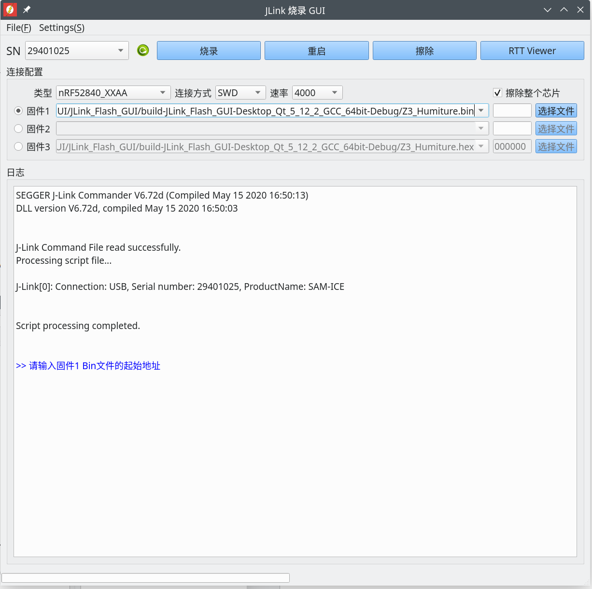
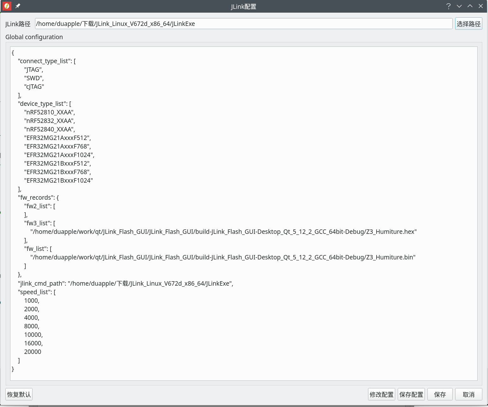

# JLink Flush GUI 程序

采用Qt 6.0.3编写。

由于`JFlush.exe`下载程序操作起来比较麻烦，因此自己写了一个GUI来调用`JLink.exe`来实现一些基本功能。

软件包： `JLink_Flush_GUI\JLink_Flush_GUI\JLink_Flash_GUI.exe` 。

程序所在路径下，必须包含配置文件夹: `config`。

## 2021-09-05

**新增:**

* 修改固件路径控件为comboBox，来支持记录。

  

* 可自定义全局配置。点击修改配置->编辑JSON文件->保存配置->重启软件。（一般只编辑device_type_list的内容，添加用户自己的设备类型。）

  

## 2021-09-03

**新增：**

* 增加多个固件功能。
* Bin文件地址可配置。
* 固件可选。
* 日志显示优化。
* Linux下进度显示。（Linux烧录Jlink不会有进度条窗口弹出，因此自己增加了一个进度条显示）

Bug：

* 启动时，未选择固件空间未禁用。

界面：

## First

### 运行

---

1. 配置`JLink.exe`。

   

   

   

2. 下载HEX固件。

